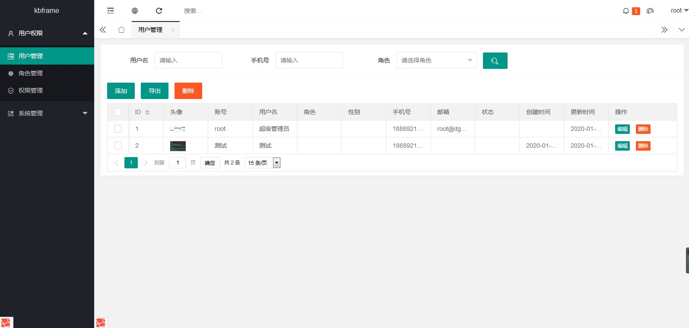

# kbframe

二次开发框架，为简化企业开发而生

### 框架介绍
这是一款基于Laravel框架开发的现代化二次开发框架，是高性能，高效率，高质量的企业级开发框架，具有驱动领域，敏捷开发，轻易上手，高内聚低耦合，开箱即用等特点。<br/>
1.x版本目前正在成长中，目的是为了简化更多企业开发，减少重复制造轮子，让开发变得更加简单。

### 开始之前
- 具备 PHP 基础知识和面向对象思维
- 具备 Laravel 基础开发知识

### 开发环境
为了解决企业项目开发过程中，让所有开发人员之间开发环境或者本地开发环境与生产环境不一致的问题。我们可以采用Laravel官方推荐的开发环境，在Vagrant的基础上使用Homestead安装开发环境，Homestead包含了你在使用Laravel开发时所需要用到的各种软件，所以可以在windows或者mac系统中编辑代码，通过同步文件到Vagrant既可。

### 内置系统
为了更好的展示实际使用，框架内置了一套完善的系统代码，包含用户管理、权限管理、角色管理、配置管理、公告管理、消息管理、行为日志等，前端采用Layui框架进行编写。


### 安装
```php
$ cp .env.example .env //复制env文件，配置好相应的配置信息，数据库必须配置
$ composer update //composer install 也行
$ php artisan app:init // 执行应用初始化
```
配置好伪静态后就可以访问了，其中nginx需要过滤掉index.php<br/>
地址：域名+/backend/login<br/>
账号：root<br/>
密码：123456
### 目录结构
```
├─app 应用模块目录
│  ├─Common 公共目录
│  │  ├─Enums 枚举类
│  │  ├─Exports 导出类
│  │  ├─Imports 导入类
│  │  ├─Rules 规则类
│  │  ├─Traits trait类
│  ├─Console 控制台目录
│  │  ├─Commands 命令类
│  ├─Events 事件目录
│  ├─Exceptions 异常目录
│  ├─Helpers 助手类目录
│  ├─Http http目录
│  │  ├─Controllers 控制器目录
│  │  ├─Middleware 中间件目录
│  │  ├─Requests 请求类目录
│  ├─Jobs 队列目录
│  ├─Listeners 监听目录
│  ├─Models 模型目录
│  ├─Providers 提供类目录
│  ├─Repositories 数据仓库目录
│  │  ├─Magics 数据查询目录
│  ├─Services 服务目录
│  ├─Widgets 小部件部门
│  ├─helper 全局助手函数类
├─bootstrap 启动模块目录
├─config 配置目录
├─database 数据文件目录
│  ├─factories 数据工厂目录
│  ├─migrations 数据迁移目录
│  ├─seeds 数据填充目录
├─docker docker目录
├─public 公共入口目录
│  ├─css css文件目录
│  ├─js js文件目录
│  ├─static 静态文件目录
│  ├─storage 存储文件目录(软连接)
│  ├─vender vender相关文件目录
├─resources 资源目录
│  ├─views 视图文件目录
├─routes 路由目录
├─storage 存储目录
├─tests 测试目录
├─vendor vendor目录
```

### 核心架构设计
代码层设计图

框架根据Laravel单一原则的思想，提高项目的可维护性，对业务代码进行了分层设计。

HTTP:用户请求<br/>
ROUTE:路由<br/>
MIDDLEWARE:中间件<br/>
REQUEST:过滤用户请求，根据RULE判断请求条件<br/>
CONTROLLER:控制器，仅控制请求、响应、核心业务方法。引入SERVICE管理逻辑代码和服务接口<br/>
MODEL:模型类，管理数据模型，关联模型，映射关系<br/>
REPOSITORY:数据仓库，协助MODEL管理<br/>
MAGIC:数据查询，管理条件查询数据<br/>
VIEW:视图类，响应视图，通过WIDGET管理代码复用<br/>

### 路由设计
采用RESTful风格设计路由名称，并对路由进行分模块，分组，中间件控制权限的设计。

### 权限管理
框架内置了一套完善的rbac权限管理，支持用户多角色管理，无限父子级权限分组、可自由分配子级权限，且按钮/链接/自定义内容/插件等都可加入权限控制，通过路由和内置函数方法检测权限

### 日志记录
框架封装了数据库操作日志、请求数据日志、行为操作日志的记录。推荐使用MongoDB记录日志，同时框架内置可切换mysql记录日志和使用队列来执行操作

### 异常管理
框架内置了全局异常接管，如果生产环境发生50x的错误，系统将错误信息实时推送给项目工作钉钉群。开发人员应收到消息后根据错误信息及时处理。

### Generate使用
框架自主研发了强大的一键生成功能，支持生成Controller类、Request类、Repository类、Magic类、Model类，提高了项目开发效率

### Helpers使用
框架使用助手类目录对全局助手类进行管理，内置了丰富的助手相关类，也可以使用全局助手文件helper.php

### 导出导入
框架内置了基于Laravel-Excel的强大的表格数据处理工具，支持多种格式使用。框架还内置了轻量级Excel助手类，可根据需求自行选择

### Widgets使用
框架采用了Widgets(小部件)对视图层进行封装，内置了丰富的表单控件，常用的图片上传、单选框、多选框、提交按钮、文本框、多行文件框、UE编辑器。开箱即用，非常实用。

### 全局说明
框架预置了多种全局枚举类，多种Traits类，多种Rules类，验证码，Debug调试器，Ide-hepler工具等，极大提升开发效率

### Guzzle使用
框架使用了Guzzle代替了原生Curl方法，框架内不允许使用原生Curl，均由Guzzle接管。框架编写了基于Guzzle同时发送的示例。

### 读写分离
Laravel内置了Mysql数据库读写分离，支持多主多从，同一请求生命周期下优先使用主库查询。

### 文件上传
支持图片上传，视频上传，语音上传，base64上传。支持本地上传和对象存储类型，目前支持本地存储、腾讯 COS、阿里云 OOS、七牛云存储一键切换，且增加其他第三方存储也非常方便，真正的开箱即用。

### 图片处理
框架封装了图片上传后支持生成多规格的缩略图，生成水印，压缩图片质量等常用操作，支持处理图片更多操作。

### 消息队列
框架内置了两种消息队列的方式(Redis,RabbitMq)，仅仅只需要修改配置参数即可使用。关于Redis和RbMq应该如何选择，Redis更轻量，RbMq功能更强大，具体需要根据实际业务需要来选择。
框架预置了多个消息队列（短信发送，邮件发送，日志记录，钉钉消息）的使用

### RabbitMQ使用
框架封装了RabbitMq的3个常用Exchange模式的使用，Direct(直连模式)、Fanout(广播模式)、Topic(主题模式)，可以根据自己需求使用对应的模式，开箱即用。同时框架封装了通过控制台模式进行消费的使用。

### Elasticsearch使用
框架封装了Mysql全量同步数据到Elasticsearch的示例，通过控制台模式进行同步。支持类似Query大部分的增删改查等基础方法使用。

### 数据字典
框架辅助分支会根据Mysql数据库生成相应的数据字典(PDF版，HTML版，MD版)，方便查询字段信息。[数据字典](docs/guide-zh-CN/data-dictionary.md) 

### Docker
搭建基础公用环境包，方便使用，支持业务不断的提升而需要一些软件的支持但由于本身不懂或耗时导致不方便安装升级的一种解决方案，同时方便结合k8s集群管理，提供了一套docker解决方案，这里推荐使用docker-compose来管理，执行项目。<br/>
[来源]：https://github.com/jianyan74/dockerfiles

## 后续计划
目前1.x版本将会是一个单模块版本，2.x版本是"多模块+插件"模式，支持模块独立部署，插件自由扩展移植，优化海量数据处理解决方案，该版本预计2020年中旬会发布更新。后续未来计划可能会用Go+协程的模式编写全新的高并发框架。

### 文档

[使用文档](docs/guide-zh-CN/readme.md) · [更新历史](docs/guide-zh-CN/update-log.md) · [常见问题](docs/guide-zh-CN/issue.md)

## 问题反馈

在使用中有任何问题，欢迎反馈给我们，可以用以下联系方式跟我们交流

* 邮件: 1194174530@qq.com
* QQ: 1194174530
* Github：https://github.com/kbdxbt/kbframe/issues

## 特别鸣谢

感谢以下的项目或作者,排名不分先后

* [laravel](https://laravel.com/)
* [layui](https://www.layui.com/)
* [jianyan74](https://github.com/jianyan74/)
* [crcms](https://github.com/crcms/)

## 关于我们

作者：狂奔的小白兔<br/>
由于作者能力或精力有限，希望大家有能力的可以加入内核开发，编写模块，编写文档，测试反馈，可以直接Pr，多提建议，感谢你的支持和鼓励。